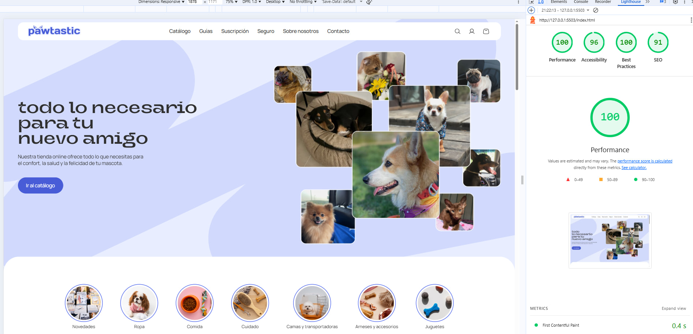

Available in: [Español](README.es.md)

# Pawtastic – Pet Store Homepage

## Project Overview
**Pawtastic** is a pre-release homepage for an online pet store. The project focuses on **responsive, semantic, and accessible web design**, implemented purely with HTML, CSS, and Sass. This project demonstrates careful attention to **Pixel Perfect design, adaptive layouts, optimization, and front-end best practices**.

This project was developed as part of a professional web development course, including work with bug lists, team lead code review, and client requirements.

---

## Technologies & Tools
- **HTML5** – semantic structure using `<main>`, `<section>`, `<form>` and other semantic tags  
- **CSS3 & Sass (SCSS)** – modular styling with variables for colors and fonts  
- **BEM Methodology** – organized and maintainable class naming  
- **Flexbox & CSS Grid** – for layout and adaptive design  
- **CSS Transitions & Hover Effects** – interactive states for buttons, links, and logo animations  
- **Responsive Design** – tested for screen widths from 360px to 4000px  
- **Accessibility Best Practices** – `aria-labels`, focus states, required fields, predictable interactive areas  
- **Optimization** – raster images prepared for 2x displays, optimized using Squoosh, lazy loading for content images  
- **Favicon & Web App Manifest** – included `site.webmanifest` and preloaded fonts  

---

## Project Highlights
- **Pixel Perfect Layout**: Layout matches Figma design with a tolerance of ±10px  
- **Adaptive and Elastic Design**: Fully responsive from mobile (360px) to large desktop screens (4000px)  
- **Bug Fixing & Code Review Implementation**: Applied fixes from bug list and team lead recommendations, including:  
  - Input and button fields properly nested in forms  
  - Correct hover/focus states for all interactive elements  
  - Removal of CSS `!important`  
  - Pointer-events disabled for decorative elements  
  - Proper container paddings for responsive layouts  
- **Interactive Elements & Animations**:  
  - Logo hover animation: color change and animated transition from cat ears to dog ears  
  - Subscription block hover animation: background line effect and image brightness adjustment  
- **Images & Graphics**:  
  - Raster images optimized for retina displays  
  - Vector images added to a sprite  
  - All images have width and height attributes to prevent layout shifts  
- **Typography & Fonts**:  
  - Fonts preloaded for performance  
  - Color variables in SCSS for consistent styling  
- **Accessibility & Semantics**:  
  - All forms use proper `required` attributes and `name/id` for inputs  
  - Hidden headings added where necessary  
  - All links and buttons have clear text or hidden labels  
- **Code Quality & Best Practices**:  
  - SCSS modular structure  
  - BEM methodology  
  - Semantic HTML5 structure  
  - Validated via HTML and BEM validators  
- **SVG Logo & Animations**:  
  - Full main logo kept inline to maintain hover animations (color change + cat/dog ear switch)   

---

## How to View / Run
Since this is a static project, no build or JavaScript setup is required. **Sass must be compiled to CSS** for the styles to appear correctly:

1. Clone the repository:
   ```bash
   git clone https://github.com/Alyona-K/pawtastic
   ```

2. Open the project folder in VS Code.

3. Start the Live Sass Compiler (or any Sass watcher) to compile SCSS into CSS.

4. Make sure the compiled CSS is saved in /css/style.css.

5. Open index.html in any modern browser (Chrome recommended).

6. Optionally, use Live Server extension in VS Code for real-time refresh:

Right-click on index.html → "Open with Live Server"

## Performance & Accessibility
This project achieves **perfect Lighthouse scores** in Performance, Accessibility, Best Practices, and SEO.  

Key factors contributing to this result:
- Preloaded fonts to avoid layout shifts  
- Defined `width` and `height` on all images  
- Optimized raster images with Squoosh (including 2x versions)  
- Proper use of semantic HTML and ARIA labels  
- No unused CSS or JavaScript


